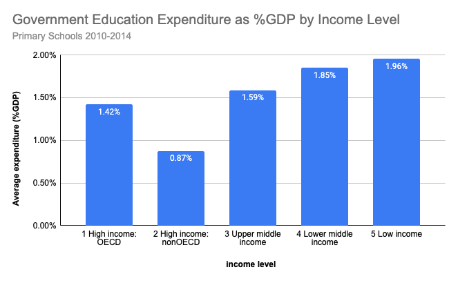
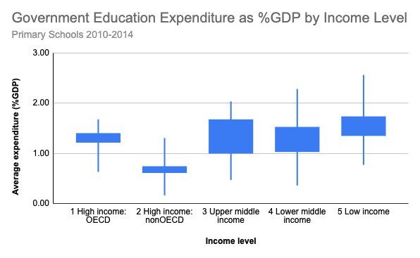

# Analyzing International Primary Education Expenditure since 2010

## 1. Data Overview
### 1.1 Database:
World Bank International Education database (BigQuery public dataset)
Dataset id: bigquery-public-data.world_bank_intl_education.

### 1.2 Data structure
The database contains the results of numerous educational studies and surveys from the 1990s to today. The database contains four tables, of which I used country_summary, series_summary, and international_education.

The metric I used to analyze the data considered all education spending, including that from international sources, on domestic education. Data on education expenditure as % of GDP (2010 and later) was available for 125 countries. Of these countries, 33 had only one year of data, but across most other countries there was little year-to-year variation in education expenditure.

## 2. Queries
    
- [country_summary_info.sql](https://github.com/lfontanills/world-bank-education/blob/104a5098cf6e81dd8ef481edbb6253827714e0f2/country_summary_info.sql): finding income group classifications, generating lists of countries by income group, determining the number of records by income group, creating a new income group ranking to make sorting easier.

- [indicators_info.sql](https://github.com/lfontanills/world-bank-education/blob/104a5098cf6e81dd8ef481edbb6253827714e0f2/indicators_info.sql): finding appropriate metric (a.k.a. _indicator_) and obtaining its unique code, name, and description.

- [eda_international_expenditure.sql](https://github.com/lfontanills/world-bank-education/blob/104a5098cf6e81dd8ef481edbb6253827714e0f2/eda_international_expenditure.sql): joining tables to analyze expenditure by income group, creating summary statistics to export to a spreadsheet.
      

## 3. Findings

       
The highest average education expenditure as % of GDP occurs in Low Income countries.  The lowest average education expenditure as % of GDP occurs in High Income, non-OECD countries. [OECD](https://www.oecd.org/about/) (Organization for Economic Co-operation and Dvelopment) is an intergovenmental organization which "establish[es] evidence-based international standards and find[s]solutions to a range of social, economic and environmental challenges." 

Three countries had average education expenditure as % of GDP greater than 3%: 

- Timor-Leste (East Asia & Pacific, Lower middle income)

- Swaziland (Sub-Saharan Africa, Lower middle income)

- Mozambique (Sub-Saharan Africa, Low income)

Four countries had average education expenditure as % of GDP less than 0.5%:

- United Arab Emirates (Middle East & North Africa, High income non-OECD)

- Monaco (Europe & Central Asia, High income non-OECD),

- Romania (Europe & Central Asia, Upper middle income),

- Sri Lanka (South Asia, Lower middle income)

The largest spread of average education expenditure as % of GDP occurs between Lower Middle Income countries (Median = 1.51%, IQR = 1.24%).

The smallest spread of average education expenditure as % of GDP occurs between High income non-OECD countries (Median = 0.73%, Range = 0.68%)

## 4. Conclusions

Spending on primary education varies within global regions and within income level groups. There is a clear and significant pattern of education spending between income level groups. Education spending as % of GDP may reflect how governments prioritizes education, but there are many factors that affect education funding.

Primary education expenditure as % of GDP is greatest in lowest income level countries, and least in High-Income non-OECD countries. Some countries in this group, like Monaco and the United Arab Emirates, are very wealthy with small school-age populations. 

Other countries with lower primary education expenditures as % of GDP merit further investigation - Germany (Europe & Central Asia, High income OECD, 0.63%) has a very low education expenditure compared to other European countries. It would be interesting to research how educational funds are allocated and used in Germany.
    
This project would be improved with access to more recent data, particularly to investigate how the COVID-19 pandemic impacted education spending in different parts of the world.

